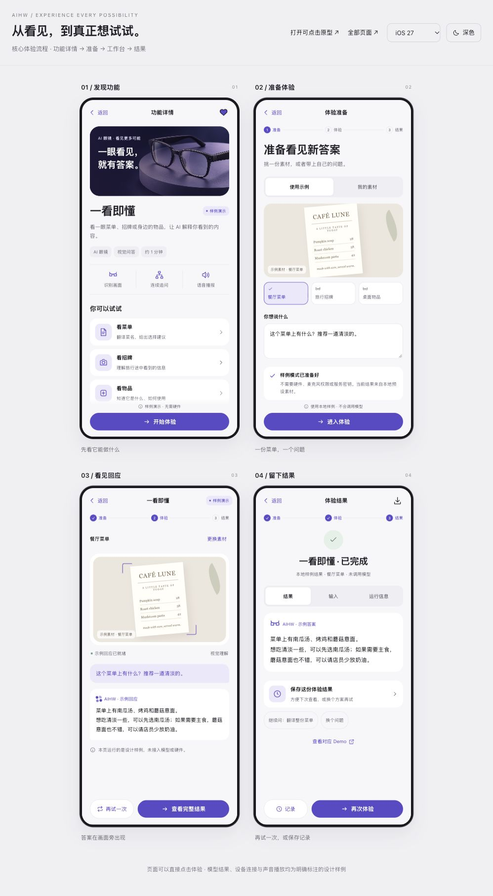

# 功能广场 APP 设计

面向产品体验者：先看到效果，再进入尝试。设计覆盖 9 类硬件、10 个品类 Demo，提供 iOS 27 / Android Material 3 双端、深浅色及手机全屏布局。

## 浏览入口

| 文件 | 内容 |
|---|---|
| [app-v2.html](./app-v2.html?screen=home) | 完整可点击原型，14 个页面视图、6 类体验工作台 |
| [overview.html](./overview.html) | 18 屏设计总览，可切换平台、外观并直接操作 |
| [flow.html](./flow.html) | 功能详情 → 准备 → 工作台 → 结果的核心流程 |
| [index.html](./index.html) | 保留的首版双端首页 |
| [完整 APP 设计说明](./%E5%AE%8C%E6%95%B4APP%E8%AE%BE%E8%AE%A1%E8%AF%B4%E6%98%8E.md) | 页面结构、Demo 映射、平台方向与运行范围 |
| [首版首页说明](./%E8%AE%BE%E8%AE%A1%E8%AF%B4%E6%98%8E.md) | 首页视觉与交互说明 |

在 [GitHub Pages 站点首页](https://smile-xuc.github.io/aihw-starter/) 进入网页 APP（[`app/`](../../app/)）。本目录 HTML 为设计存档，可离线打开；GitHub 仓库里的 HTML 链接显示源文件。

主原型、总览、流程和首版首页均内嵌图像、样式及脚本。文件之间的快捷链接使用相对路径，分享整套设计时保持目录结构即可。

桌面原型顶部可选择页面、Demo、平台与外观。手机视口下自动进入全屏 APP；`?platform=ios`、`?platform=android` 可指定平台，`&theme=dark` 可指定深色模式。

## 原型范围

- 搜索、筛选、收藏、记录、示例素材选择、本地文件预览可操作。
- 工作台支持样例过程、停止、重试、结果与追问；结果可预览并选择文本复制。
- AI 输出与 Benchmark 比较使用预设或仓库历史参考，不调用真实模型，不产生模型用量。
- 声音波形和播放行为为界面示意，不包含真实克隆音频；设备、服务连接为模拟状态。
- 实体硬件与模型服务的实际接入通过仓库对应的 [品类 Demo](../../../solutions/by-category/README.md) 完成。

原型用 CSS 像素表达原生平台设计方向。正式实现需采用原生组件、动态字体和安全区；HTML 不能替代系统级 Liquid Glass 或原生规范验收。

## 评审后的方向：用户自填 Key

原型「服务与设置」页设想由服务端代持 Key 调用模型，这一方案不再采用。APP 和网页都由用户自己填对应平台的 Key 和接入点（百炼：API Key、地域、业务空间 ID），只存在用户本机的浏览器存储里，只发往该平台的官方接入点，不经过任何我们自己的服务器；没填时走回放。细节见[完整 APP 设计说明 ·「Key 与运行方式」](./%E5%AE%8C%E6%95%B4APP%E8%AE%BE%E8%AE%A1%E8%AF%B4%E6%98%8E.md#key-与运行方式2026-10-02-修订)。

第一版实现是 GitHub Pages 上的网页 APP（可添加到主屏）：[`docs/app/`](../../app/README.md)。本目录的原型保留为设计存档。

## 预览与验证

- [全部页面预览](./app-overview.jpg)
- [Android 深色流程](./app-flow-android-dark.jpg)
- [iOS 手机预览](./app-mobile-ios.jpg) · [Android 手机深色预览](./app-mobile-android-dark.jpg)
- [完整 APP 验证记录](./app-v2-verification.json) · [首版首页验证记录](./verification.json)

验证记录随设计交付保留。TXT 下载取决于浏览器支持，导出面板提供可选择复制的文本作为替代。

眼镜主图为生成的概念素材，菜单、招牌、公园与桌宠为设计示意。[主图提示词](./prompts/01-hero-ai-glasses.md) 与原始图片随目录保存。
