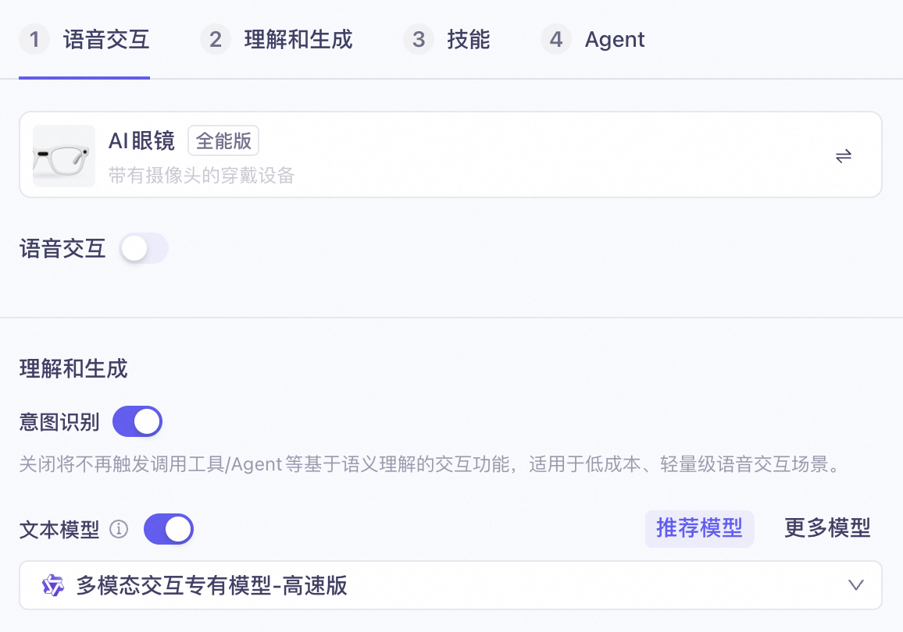
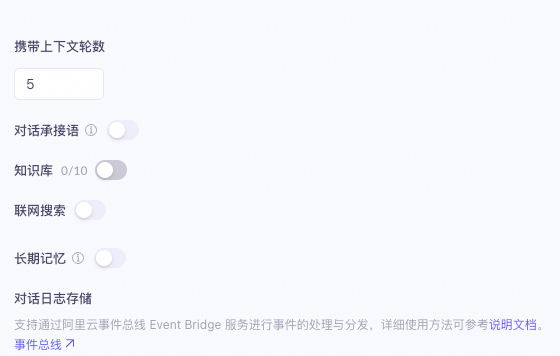
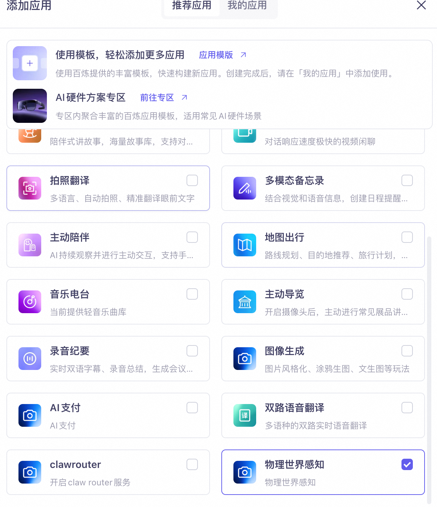
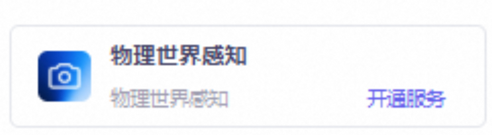
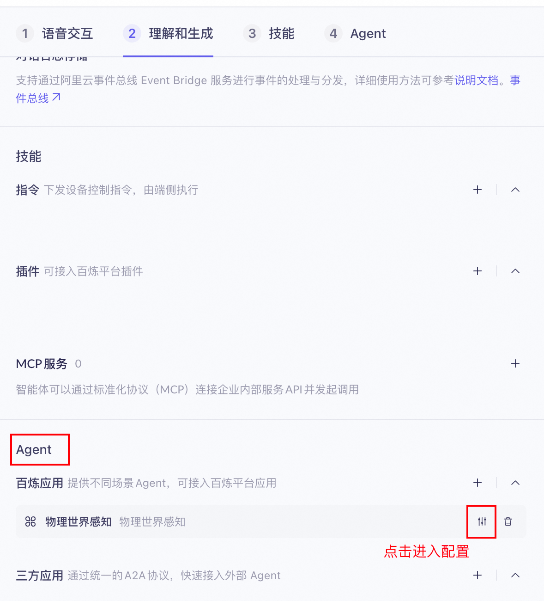
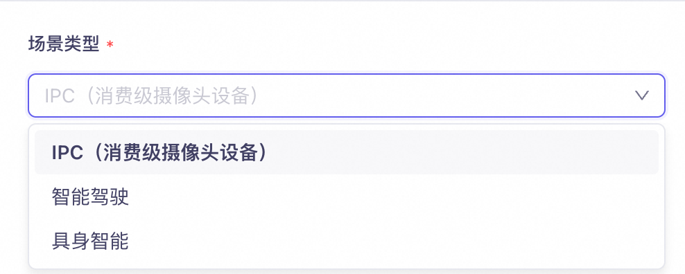

# 推荐方案与接入指南

> **方案版本**：千问大模型方案（首发版）
>
> **品类**：智能摄像头 / 智能门铃 / 可穿戴拍摄设备 / 人形巡检机器人
>
> **核心能力**：OSS AI 内容感知（视频/图片以文搜图）+ Qwen-VL 视觉模型
>
> 本文档基于千问（Qwen）大模型生态。其他厂商方案欢迎通过 PR 补充为 `02-solution-{model}.md`。

---

## 方案总览

IPC 品类当前提供 **两类接入方式**，可按需选用或组合使用：

1. [**百炼 — 物理世界感知 Agent 接入**](#一百炼--物理世界感知-agent-接入)
2. [**OSS — AI 内容感知接入**](#二oss--ai-内容感知接入)

| 维度 | 百炼 · 物理世界感知 Agent | OSS · AI 内容感知 |
|---|---|---|
| 核心能力 | 视频摘要（Caption） | 摘要 + 检索 + 自定义事件告警 + 每日总结 + 一键成片 |
| 触发方式 | 主动调 API，逐帧/逐段请求 | 文件写入 OSS 自动触发 |
| 适用时机 | 实时事件触发分析、单帧/短片段摘要 | 事后批量索引、自然语言检索、自动剪辑 |
| 性价比 | 更高（按调用次数计费，轻量场景优势明显） | 较高（全套能力，按文件量+API 次数复合计费） |
| 典型场景 | 事件录像推送摘要、AI 相册标签 | "找小孩跳沙发那段"、每日精彩瞬间、智能告警订阅 |
| 输出形态 | 结构化 JSON（object/action/event/description/title） | description + summary + 向量索引 |
| 部署复杂度 | 低（HTTP API 即调即用） | 中（需配置 OSS Bucket + 数据索引规则） |

**选型建议**：

- 仅需摘要（Caption）能力、或预算敏感 → 优先百炼方案
- 需要完整检索 + 告警 + 每日总结 + 成片能力 → 走 OSS 方案
- 两者可组合：实时由百炼生成 Caption → 写入 OSS → 被 AI 内容感知索引 → 支持后续检索

---

## 一、百炼 — 物理世界感知 Agent 接入

### 功能定位

面向消费级摄像头场景，对 IPC 事件帧或短视频片段进行环境分析、行为识别和事件检测，输出结构化摘要（Caption）。

输出结构：

```json
{
  "object": ["女性成人"],
  "action": [],
  "event": [],
  "description": "一位年轻的女性成人，黑色头发扎成低马尾，身穿黑色高领拉链外套，背景为模糊的书架。",
  "title": "女子静立书架前"
}
```

| 字段 | 含义 |
|---|---|
| `object` | 画面中识别到的主体（人物、宠物、车辆等） |
| `action` | 正在发生的动作 |
| `event` | 识别到的事件（如闯入、摔倒、异常停留） |
| `description` | 100 字以内的详细场景描述 |
| `title` | 20 字以内的精简摘要标题 |

典型应用：事件录像自动摘要（替代传统"人形检测"推送）、AI 相册自动标签、监控回放的文字检索入口。

### 接入链路

```
[IPC 事件帧/短视频] → [设备端抽帧或上传] → [百炼多模态交互 API]
                                                    ↓
                                          [物理世界感知 Agent · IPC 场景]
                                                    ↓
                                          [结构化 Caption JSON 返回]
```

底层走阿里云百炼的**多模态交互**接口（model = `multimodal-dialog`），通过「物理世界感知 Agent」路由到 IPC 场景模型。

### 管控台配置（图文教程）

#### Step 1：创建多模态交互应用

进入百炼控制台 → 多模态开发套件 → 创建应用，选择**全能版**（不要选视觉版）。关闭语音交互，保持意图识别和文本模型开启。



#### Step 2：关闭无关功能

将**对话承接语**、**知识库**、**联网搜索**、**长期记忆**全部关闭。这些功能在 IPC Caption 场景下不需要，关闭可降低延迟和成本。



#### Step 3：添加物理世界感知 Agent

在「Agent」配置区 → 百炼应用 → 点击「+」添加 → 勾选**物理世界感知**。技能、MCP 服务、插件全部清空，只保留物理世界感知 Agent。



#### Step 4：开通物理世界感知服务

首次使用需点击「开通服务」激活物理世界感知能力。



#### Step 5：进入 Agent 配置

在 Agent 区域找到已添加的「物理世界感知」，点击右侧配置按钮进入详细设置。



#### Step 6：选择 IPC 场景

在场景类型下拉框中选择 **IPC（消费级摄像头设备）**。另有「智能驾驶」和「具身智能」两个场景可选，本文档针对 IPC。



#### Step 7：发布

配置完成后点击右上角**发布**按钮。必须发布后才能通过 API 调用。

### HTTP 协议接入

#### 请求地址

```
POST https://dashscope.aliyuncs.com/api/v1/services/aigc/multimodal-generation/generation
```

#### 请求头

```
Authorization: Bearer {YOUR_API_KEY}
Content-Type: application/json
X-DashScope-SSE: enable
```

#### 请求体

```json
{
  "model": "multimodal-dialog",
  "input": {
    "directive": "Request",
    "app_id": "{YOUR_APP_ID}",
    "text": ""
  },
  "parameters": {
    "client_info": {
      "user_id": "{END_USER_ID}",
      "device": {
        "uuid": "{DEVICE_UUID}"
      }
    },
    "biz_params": {
      "commands": [{
        "name": "agent_command",
        "exec_params": {
          "app_id": "physical_sense",
          "intent": "open_physical_sense",
          "slots": [{
            "name": "scene",
            "norm_value": "ipc"
          }]
        }
      }],
      "user_defined_params": {
        "physical_sense": {
          "user_prompt_params": {
            "param": {
              "format": "image",
              "prompt": "",
              "images": [
                {
                  "type": "url",
                  "value": "https://example.com/event-frame.jpg"
                }
              ]
            }
          }
        }
      }
    }
  }
}
```

#### 关键参数说明

| 参数路径 | 说明 |
|---|---|
| `model` | 固定 `multimodal-dialog` |
| `input.app_id` | 在百炼「我的应用」页面获取 |
| `input.text` | 本场景置为空字符串 `""` |
| `client_info.user_id` | 终端用户 ID，最长 36 字符 |
| `client_info.device.uuid` | 设备唯一 ID，最长 40 字符 |
| `commands[0].exec_params.slots` | 场景槽位：`ipc` / `embodied` / `auto_driving` |
| `user_prompt_params.param.format` | 资源类型：`image` 或 `video` |
| `user_prompt_params.param.prompt` | 可选自定义提示词（空则用默认） |
| `user_prompt_params.param.images[].type` | `url`（HTTPS）或 `base64` |
| `user_prompt_params.param.images[].value` | 图片 URL 或 base64 字符串 |

#### 约束

- 图片分辨率推荐 640×480 ~ 1920×1080
- `type=base64` 时，所有 image 累加不超过 10 MB
- `type=url` 时必须 HTTPS，不支持 HTTP

### 返回解析

返回以 SSE 事件流推送，只需关注 `finished=true` 的最终包：

```json
{
  "output": {
    "finished": true,
    "finish_reason": "stop",
    "text": "{\"object\": [\"女性成人\"], \"action\": [], \"event\": [], \"description\": \"一位年轻的女性成人...\", \"title\": \"女子静立书架前\"}",
    "event": "RespondingContent",
    "dialog_id": "0a40fa17-faaa-4b3c-9b78-8e683a5ff7ad",
    "extra_info": {
      "agent_info": {
        "intent_infos": [{
          "intent": "open_physical_sense",
          "domain": "physical_sense"
        }]
      }
    }
  },
  "request_id": "xxx"
}
```

`output.text` 为 JSON 字符串，需二次 `JSON.parse()` 得到结构化 Caption。

### curl 完整示例

```bash
curl --request POST \
  --url https://dashscope.aliyuncs.com/api/v1/services/aigc/multimodal-generation/generation \
  --header 'Authorization: Bearer YOUR_API_KEY' \
  --header 'Content-Type: application/json' \
  --header 'X-DashScope-SSE: enable' \
  --data '{
"model": "multimodal-dialog",
"input": {
  "directive": "Request",
  "app_id": "YOUR_APP_ID",
  "text": ""
},
"parameters": {
  "client_info": {
    "user_id": "user_001",
    "device": { "uuid": "cam_livingroom_01" }
  },
  "biz_params": {
    "commands": [{
      "name": "agent_command",
      "exec_params": {
        "app_id": "physical_sense",
        "intent": "open_physical_sense",
        "slots": [{ "name": "scene", "norm_value": "ipc" }]
      }
    }],
    "user_defined_params": {
      "physical_sense": {
        "user_prompt_params": {
          "param": {
            "format": "image",
            "prompt": "",
            "images": [{
              "type": "url",
              "value": "https://your-oss-bucket.oss-cn-hangzhou.aliyuncs.com/events/frame_001.jpg"
            }]
          }
        }
      }
    }
  }
}
}'
```

### 与 OSS AI 内容感知的组合

典型组合路径：实时由百炼 Caption 生成摘要 → 摘要文本和原始帧写入 OSS → 被 AI 内容感知自动索引 → 支持后续自然语言检索与每日总结。

---

## 二、OSS — AI 内容感知接入

### 能力概述

OSS AI 内容感知是阿里云对象存储原生提供的「以文搜图/搜视频」能力。上传到 Bucket 的视频和图片会自动生成：

- 100 字详细描述
- 20 字精简摘要
- 向量索引

支持自然语言查询直接召回，完全 Serverless，无需自己搭建向量库。配合 Qwen-VL 视觉模型可以实现「事件检测、场景描述、智能剪辑」等高级能力。

典型场景：

- IPC 云存量用户的「AI 摘要 + 智能搜索」订阅升级
- 人形/可穿戴拍摄设备的「自动相册」
- 商业监控的事件回查

### 推荐链路总览

```
[摄像头] → [实时上传 OSS] → [AI 内容感知自动索引（Serverless）]
              ↓                       ↓
         [Qwen-VL 实时分析]      [App 自然语言搜索 DoMetaQuery]
              ↓
         [事件告警推送]
```

### 接入前置

| 项目 | 说明 |
|---|---|
| OSS 服务 | 阿里云 OSS Bucket，存放视频/图片 |
| AI 内容感知 | 在 Bucket 数据索引中开启 |
| API-KEY | OSS AccessKey + 千问大模型 API-KEY（用 Qwen-VL 时） |
| 地域 | 华北 2/3、华东 1/2、华南 1、西南 1、新加坡、美国（弗吉尼亚）；新加坡和美国需提工单开通 |

### 关键参数与硬约束

#### 三段计费模型

OSS AI 内容感知按以下三个维度独立计费：

1. **数据索引费用**（向量检索模式）
2. **AI 内容感知费用**（按图片/视频文件类型与用量）
3. **API 请求费用**（ListObjects / HeadObject / GetObject 等）

**控费技巧**：开启时设置最多 5 条文件过滤规则（按前缀如 `videos/`、文件大小、LastModifiedTime、ObjectTag），避免全 Bucket 索引带来的成本失控。

#### 索引时延

- 首次开启：「数分钟到数小时」（取决于存量文件量）
- 增量索引：自动触发，无具体 SLA

#### 准确率

官方文档无量化值。建议接入后用客户实际场景跑 demo，把召回效果直观演示给客户看。

#### 与 Qwen-VL 的关系

- OSS AI 内容感知：批量索引、检索、生成摘要 → 适合「事后回查」
- Qwen-VL 系列模型：实时视频/图片理解 → 适合「事件触发分析」

两者可组合使用：实时由 Qwen-VL 触发告警，事后由 OSS 检索回查。

### 接入步骤

#### 控制台路径（最快验证）

1. OSS 控制台 → 选中目标 Bucket → 数据索引
2. 开启「视频内容感知」或「图片内容感知」
3. 配置文件过滤规则（必做，控成本）
4. 等待首次索引完成（看文件量 5 分钟到几小时）
5. 在控制台搜索框测试自然语言查询效果

#### 代码接入

DoMetaQuery 调用（ossutil 命令行）：

```bash
ossutil api do-meta-query --bucket examplebucket \
  --meta-query "{\"Query\":\"小孩在沙发上跳\",\"MediaTypes\":{\"MediaType\":\"video\"}}" \
  --meta-query-mode semantic
```

SDK 调用（Python）：

```python
import oss2

auth = oss2.Auth("YOUR_AK", "YOUR_SK")
bucket = oss2.Bucket(auth, "https://oss-cn-hangzhou.aliyuncs.com", "examplebucket")

result = bucket.do_meta_query(
    query='{"Query":"小孩在沙发上跳","MediaTypes":{"MediaType":"video"}}',
    mode="semantic",
)
for f in result.files:
    print(f.file_name, f.description, f.summary)
```

返回字段示例：

```json
{
  "files": [
    {
      "file_name": "videos/cam01_2026_06_24_10_30.mp4",
      "description": "客厅沙发上一个小男孩在跳跃，旁边有一只白色的猫...",
      "summary": "小男孩沙发跳跃，猫在旁边",
      "score": 0.87
    }
  ]
}
```

#### 与 Qwen-VL 组合（实时分析）

```python
from openai import OpenAI

client = OpenAI(
    api_key="YOUR_DASHSCOPE_API_KEY",
    base_url="https://dashscope.aliyuncs.com/compatible-mode/v1",
)

response = client.chat.completions.create(
    model="qwen-vl-plus",
    messages=[{
        "role": "user",
        "content": [
            {"type": "image_url", "image_url": {"url": "https://your-cdn/frame.jpg"}},
            {"type": "text", "text": "画面中有几个人？是否有异常行为？"},
        ],
    }],
)
```

### 示例与模板

#### 文件过滤规则示例

控制台可配置最多 5 条：

| 规则类型 | 示例值 | 用途 |
|---|---|---|
| 前缀 | `videos/event/` | 只索引「事件录像」目录 |
| 文件大小 | `> 1MB` | 过滤掉缩略图 |
| LastModifiedTime | 最近 7 天 | 历史录像不索引 |
| ObjectTag | `index=true` | 应用层显式标记 |

#### IPC 订阅升级路径（针对已有云存的存量用户）

| 存量功能 | AI 升级点 |
|---|---|
| 24 小时滚动云存 | 自动生成「今日精彩瞬间」摘要 |
| 事件录像（人形/移动） | 中文化描述 + 自然语言检索 |
| 看回放 | 「找小孩跳下沙发那段」直接定位 |
| 推送告警 | Qwen-VL 二次确认，降低误报 |

存量 Bucket 可直接开启 AI 内容感知，**无需迁移数据**。

### 能力边界

- **能做**：存量 Bucket 零迁移升级、自然语言搜视频/图、事件实时分析、告警二次确认
- **不能做（当前）**：本地化/私有化部署（OSS 原生服务）、秒级实时索引（增量自动触发，无 SLA 保证）
- **建议自建的部分**：用户管理与计费、订阅生命周期、推送规则引擎

### 计费与配额

| 项目 | 计费方式 | 备注 |
|---|---|---|
| 数据索引 | 按文件数+索引存储 | 向量库托管 |
| AI 内容感知 | 按视频时长 / 图片张数 | 文件首次进入 Bucket 时计费 |
| DoMetaQuery API | 按调用次数 | 按 OSS API 标准计费 |
| Qwen-VL 调用 | 按 token | 实时分析时使用 |

具体单价见 [OSS 计费页面](https://www.aliyun.com/price/product#/oss/detail) 与千问大模型计费页面。

### 官方文档与 SDK 链接

- OSS AI 内容感知：https://help.aliyun.com/zh/oss/user-guide/ai-content-awareness
- Qwen-VL 视觉模型：https://help.aliyun.com/zh/model-studio/vision
- DoMetaQuery API 参考：https://help.aliyun.com/zh/oss/developer-reference/dometaquery
